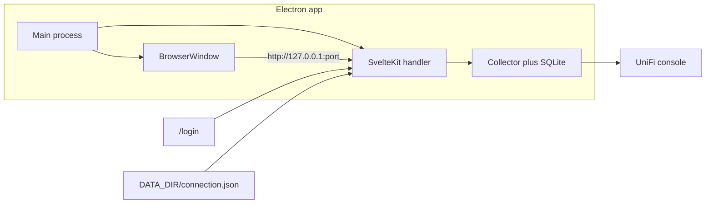

# TODO

Working checklist for converting Networker to a Mac Electron app with an in-app login page.

**Plan:** [Mac Electron App](/Users/alexhladun/.cursor/plans/mac_electron_app_2196f988.plan.md)

The sections below are a copy of that plan. Prefer the plan file if the two ever diverge.

## Checklist

- [ ] Add `/login` form and `POST /api/connection` that validates UniFi API key plus local username/password, persists them under `DATA_DIR`, and restarts the collector
- [ ] Load connection file from `DATA_DIR`, merge with optional env overrides, and add `applyConfig` so login can swap the provider without quitting
- [ ] Add Electron main/preload that sets `DATA_DIR`, starts the SvelteKit server, and opens a secure `BrowserWindow`
- [ ] Add Electron deps, pnpm scripts, electron-builder Mac arm64 config, and `better-sqlite3` rebuild/unpack
- [ ] Update README and dashboard copy for login-based setup; keep `.env` as an optional override

---

# Convert Networker to a Mac Electron App

The app is a SvelteKit Node server ([`@sveltejs/adapter-node`](vite.config.ts)) with an in-process UniFi collector and `better-sqlite3`. Electron will be a thin native shell: start the existing server on localhost, open it in a `BrowserWindow`. No rewrite of dashboard routes, collector telemetry, or SQLite.

First launch opens a **login / connection page**. The user enters console URL, Integration API key, and the local UniFi username/password. Those values are saved under `DATA_DIR` (not SQLite, not a hand-edited `.env`). Docker and `pnpm dev` get the same page.



## Approach

**Development:** run Vite as today, then launch Electron against `http://127.0.0.1:5173`. The collector already starts from [`src/hooks.server.ts`](src/hooks.server.ts).

**Packaged Mac app:** `vite build` produces `build/handler.js`. The Electron main process imports that handler, listens on `127.0.0.1` with an ephemeral port, then loads that URL. Closing the window quits the app so the collector does not keep running in the background.

This avoids moving APIs to IPC and keeps one instance of the collector (required by the current design).

## Login page

New route [`src/routes/login/+page.svelte`](src/routes/login/+page.svelte), shown whenever `isConfigured` is false.

Form fields (all required unless noted):

- Console URL (e.g. `https://192.168.1.1`)
- Integration API key
- Local UniFi username
- Local UniFi password
- Site (optional, default `default`)
- Verify TLS (optional checkbox; default off to match typical factory console certs)

Submit `POST /api/connection`:

1. Validate with Zod
2. Probe both UniFi auth paths before saving: Integration API key (`IntegrationClient`) and classic `/api/auth/login` (`ClassicClient`)
3. On failure, stay on the form with a clear error (which credential failed)
4. On success, write `DATA_DIR/connection.json` with mode `0600`, never write secrets to SQLite
5. Call `applyConfig()` to stop the old collector, build a new `UniFiProvider`, and start polling — no app restart
6. Redirect to `/`

[`src/hooks.server.ts`](src/hooks.server.ts) redirects `/` to `/login` when not configured (allow `/login` and `/api/connection`). Dashboard unconfigured banner in [`src/routes/+page.svelte`](src/routes/+page.svelte) becomes a link to `/login` instead of “copy `.env.example`”. Add a small **Change connection** control on the dashboard so credentials can be updated later; password/API key fields stay empty when editing.

GET `/api/connection` returns non-secret fields only (`unifiUrl`, `site`, `verifyTls`, `configured`, whether a key/username is stored). Never echo the API key or password.

## Config load order

Update [`src/lib/server/config.ts`](src/lib/server/config.ts) and [`src/lib/server/runtime.ts`](src/lib/server/runtime.ts):

1. Optional env still wins (Docker, CI, `UNIFI_FIXTURE_MODE`)
2. Else `DATA_DIR/connection.json`
3. Else unconfigured → login page

`DATA_DIR` is `./data` in dev/Docker and `~/Library/Application Support/UniFi Beacon Monitor/data` in the packaged app. Electron does not require a `.env` file.

Add `applyConfig(next)` on the runtime singleton: keep the same SQLite connection, replace `config` / provider / collector, then `start()`.

## Electron files

- [`electron/main.mjs`](electron/main.mjs) — app lifecycle, server start, window
- [`electron/preload.mjs`](electron/preload.mjs) — empty/minimal; `nodeIntegration: false`, `contextIsolation: true`, `sandbox: true`
- [`electron-builder.yml`](electron-builder.yml) — Mac `dmg` + `zip`, unsigned local build (`identity: null`), `NSLocalNetworkUsageDescription` so the collector can reach a LAN UniFi console

Main-process behavior:

- Single-instance lock (`app.requestSingleInstanceLock`) so two windows do not share one SQLite file
- `DATA_DIR` defaults to Application Support (see above)
- Start polling immediately after listen by requesting `/api/health` (hooks only start the collector on the first HTTP request today)
- Optional **Open data folder** menu for support; not the setup path

## Package and native module work

Update [`package.json`](package.json):

- `"main": "electron/main.mjs"`
- Scripts: `electron:dev`, `electron:build`
- Dev deps: `electron`, `electron-builder`, `@electron/rebuild`, `concurrently`, `wait-on`
- Add `electron` (and rebuild tooling) to `pnpm.onlyBuiltDependencies` so native install scripts run

`better-sqlite3` must be rebuilt for Electron’s Node ABI and unpacked from asar (`asarUnpack: **/*.node`). `electron-builder` `install-app-deps` handles this at package time.

Target **darwin arm64** (this Mac). Unsigned `.app` / `.dmg` is enough for local use; Gatekeeper will require right-click → Open the first time.

## Docs

- [`.gitignore`](.gitignore): add `/release`
- [`README.md`](README.md): Mac desktop run + build; login page as the normal setup; `.env` remains an optional override for Docker/automation

## How you will run it

```sh
pnpm install
pnpm electron:dev          # window against Vite
pnpm electron:build        # release/mac-arm64/*.dmg and *.app
```

Open the `.app` or `.dmg`, fill in the login page, and use the dashboard. History stays in `data/networker.sqlite` under `DATA_DIR`.

## Out of scope

- Code signing / notarization
- Removing Docker
- Changing collector telemetry, UniFi clients, or dashboard charts
- Encrypting `connection.json` beyond file mode `0600` (local-only desktop app)
